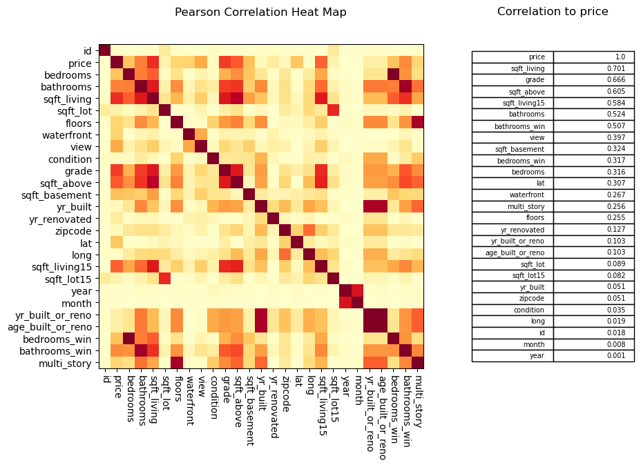
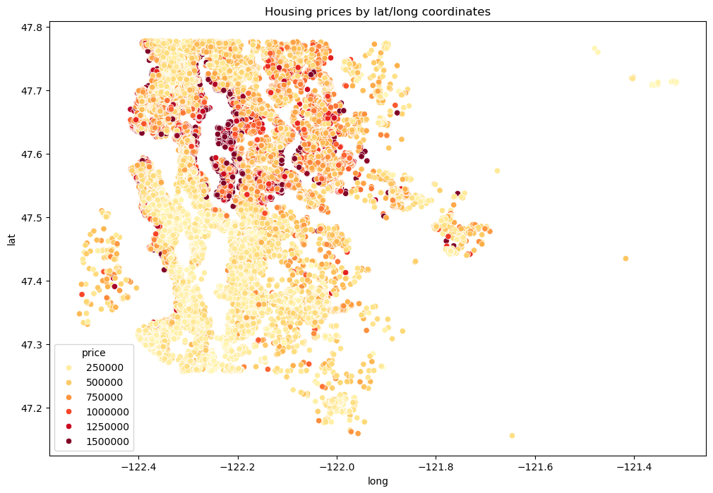
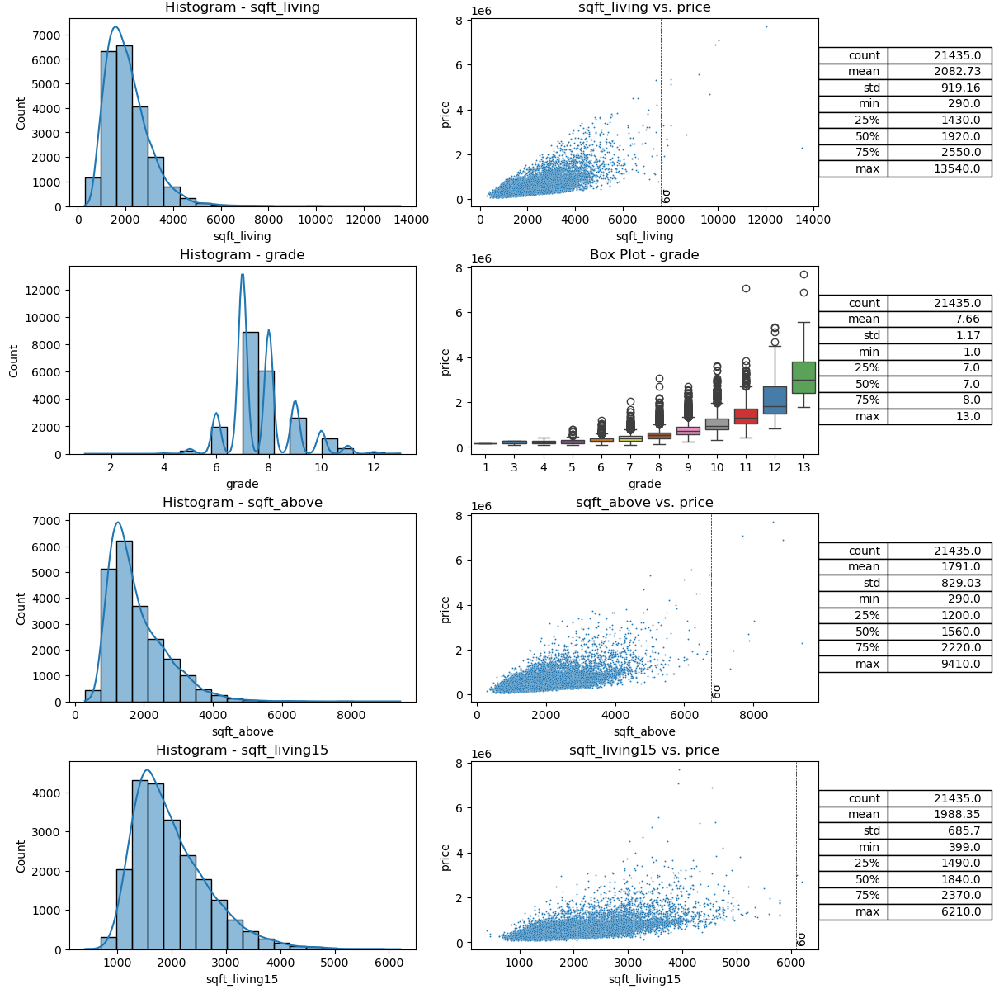
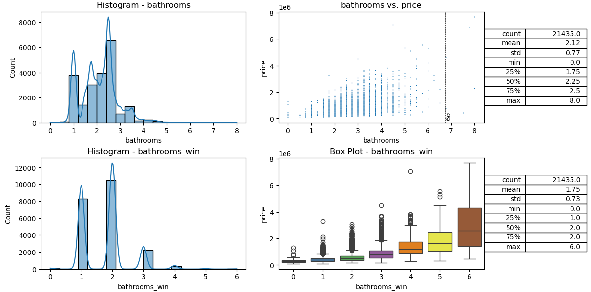
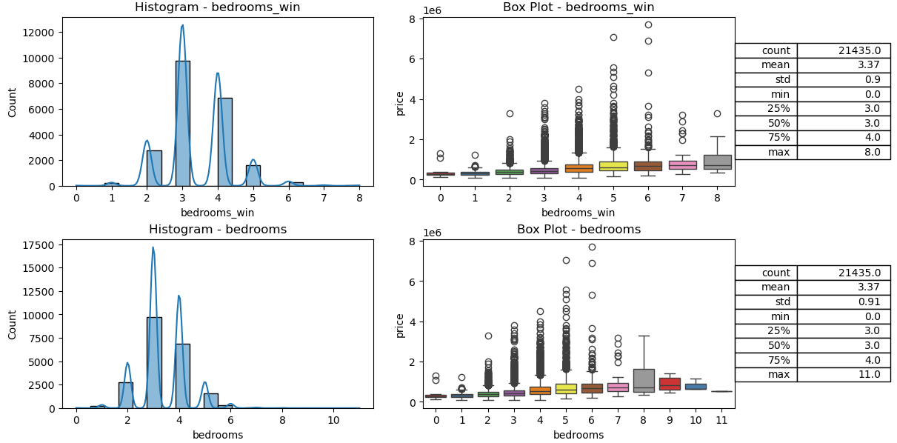
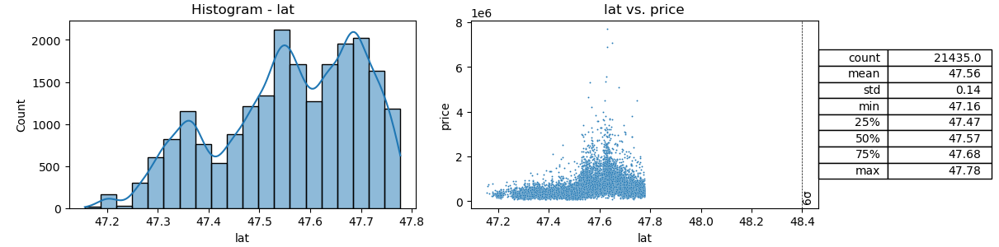

# Housing Prices in King County, Washington

**Table of Contents**

1. [Project Summary](#project-summary)
2. [Results](#results)
	- [Baseline Model Performance](#baseline-model-performance)
	- [Effect of Outlier Filtering](#effect-of-outlier-filtering)
	- [Role of Spatial Features](#role-of-spatial-features)
	- [Advanced Feature Engineering Results](#advanced-feature-engineering-results)
3. [Key Takeaways](#key-takeaways)
4. [Data Visualization](#data-visualization)

## Project Summary

This project explores housing price prediction in King County, Washington using linear regression–based models. Starting from a broad set of structural and geographic features, the goal was to understand how much of housing price variation can be explained by linear relationships, and where those models begin to break down.

Rather than focusing solely on maximizing performance, the emphasis was on:
- Careful data cleaning and feature treatment, especially for ordinal and hybrid variables
- Understanding the limitations of linear models in a spatial, economically complex problem
- Interpreting model coefficients and residual behavior
- Evaluating the impact of regularization, outlier handling, and feature selection

Linear Regression, Ridge, and Lasso models were compared using R2, MAE, and RMSE, with additional experiments examining the effects of outlier filtering, spatial features, and feature engineering. The project ultimately highlights both the strengths and shortcomings of linear regression when applied to real-world housing data.

[King County House Sales dataset (Kaggle)](https://www.kaggle.com/datasets/harlfoxem/housesalesprediction)

---

## Results

### Baseline Model Performance

Using a cleaned feature set focused on physical property attributes (e.g., square footage, grade, bedrooms, bathrooms, age, and view), the baseline linear regression model achieved:
- R2test: ~0.62
- MAE: ~$129k
- RMSE: ~$184k
- Median home price: $450k

This indicates that roughly 60–65% of price variance can be explained by linear relationships using readily available housing attributes. Regularization via Ridge and Lasso did not materially improve performance, suggesting limited multicollinearity and that the dominant predictors were already well-captured.

Key consistently important features included:
- Living space (sqft)
- Construction quality (grade)
- View, bedrooms, and bathrooms

Lasso regression removed several weaker predictors (e.g., sqft_lot, waterfront in some runs), but without improving overall error metrics.

| Model  | Alpha | Num Features | R2train | R2test | MAE | RMSE | Num Significant Features |
| ------ | ----- | ---------- | -------- | ------- | -------- | --------- | ---------------|
| linear |       | 14 | 0.62 | 0.62 | 131328.78 | 194863.95 | 14 | 
| lasso  | 1000  | 14 | 0.62 | 0.63 | 131163.72 | 194823.27 | 11 | 
| ridge  | 1000  | 14 | 0.62 | 0.62 | 131003.71 | 194944.16 | 13 | 

---

### Effect of Outlier Filtering

Applying sigma-based filtering to continuous variables revealed an important trade-off:
- Moderate filtering (6-sigma) removed ~2% of data and improved:
- MAE by 1-2%
- RMSE by 5%
- Aggressive filtering (≤4-sigma) continued to improve MAE/RMSE but degraded R² and destabilized median price estimates

This suggests that extreme price and size outliers meaningfully inflate error metrics, but overly aggressive removal sacrifices representativeness and explanatory power.

| Sigma Filter | Num Rows | % Removed | Median Price | Model          | R2train | R2test | MAE | RMSE | 
| ------------ | -------- | --------- | ------------ | -------------- | -------- | --------| ----------| ----------|
| 10           | 21212    | 1.0       | 450000       |  ridge 1000    | 0.62     | 0.62    | 131003.71 | 194944.16 | 
| 8            | 21175    | 1.2       | 450000       |  ridge 1000    |  0.62    | 0.61    | 134201.34 | 195941.72 |
| 6            | 20953    | 2.3       | 450000       |  ridge 1000    |  0.62    | 0.62    | 128906.1  | 184254.13 |
| 4            | 19613    | 8.5       | 440000       |  ridge 1000    |  0.61    | 0.59    | 120750.09 | 166770.1  |
| 3            | 18539    | 13.5      | 441875       |  ridge 1000    |  0.57    | 0.56    | 113496.46 | 151316.75 |

---

### Role of Spatial Features

Geographic variables had a disproportionate impact on performance:
- Latitude alone significantly boosted R² and reduced error
- Removing latitude caused model performance to revert to non-spatial baselines
- Zipcode provided weaker gains unless explicitly engineered

This indicates that latitude is acting as a proxy for neighborhood desirability, clustering high-value regions (e.g., Bellevue, Kirkland, Redmond) rather than capturing a generalizable spatial relationship. While effective within this dataset, this behavior would not reliably transfer to other regions.

| Feature Strategy   | Num Features | Sigma Filter | Model     | R2train | R2test | MAE | RMSE |
| ------------------ |------------  | ------------ | --------- | --------- | ------- | ----------| ----------|
| Original data columns       | 19  | 6            | linear    | 0.69      | 0.69    | 114017.67 | 167531.37 | 
| lat/long removed            | 17  | 6            | linear    | 0.62      | 0.62    | 128986.15 | 184210.92 | 
| zipcode removed             | 18  | 6            | linear    | 0.69      | 0.68    | 114162.04 | 168681.96 | 
| All spatial columns removed | 16  | 6            | linear    | 0.62      | 0.62    | 129052.86 | 184161.64 | 

---

### Advanced Feature Engineering Results

Substantial gains were achieved by introducing contextual price information:
- KNN-based price imputation using historical sales reduced MAE by up to ~18%
- Utilizing GIS libraries to convert lat/long to neighborhoods – better localization than zip code
- Ordinalizing zipcodes and neighborhoods by median price further improved results
- Combining neighborhood ranking + KNN imputation + moderate filtering yielded the best performance

Best overall model:
- R2: ~0.79
- MAE: 35–37% improvement over baseline
- RMSE: 33% improvement over baseline

These gains demonstrate that relative, location-aware pricing context is more valuable than raw structural features alone.

| Test                                        | R2test | MAE | RMSE |
| ------------------------------------------- | ---- | ------ | ------ |
| Model Baseline (linear, 10-sigma filter)    | 0.60 | 140413 | 200914 |
| Baseline, remove months 0-4                 | 0.61 | +3%    | +13%   |
| Add KNN, 12 months data                     | 0.66 | -8%    | -7%    |
| Add KNN, remove months 0-4                  | 0.73 | -18%   | -6%    |
| Zipcode + KNN                               | 0.77 | -28%   | -11%   |
| Neighborhood + Zipcode + KNN                | 0.76 | -31%   | -22%   |
| Neighborhood + KNN                          | 0.72 | -21%   | -16%   | 
| Neighborhood + Zipcode + KNN + 6s filtering | 0.79 | -35%   | -33%   |
| Best model + Ridge, alpha=1000              | 0.79 | -36%   | -33%   |
| Best model + Lasso, alpha=10000             | 0.79 | -37%   | -33%   |

---

## Key Takeaways
- Linear regression performs surprisingly well given limited features, but plateaus around R2 ≈ 0.6 without contextual data
- Regularization provides minimal benefit unless new, higher-leverage features are introduced
- Neighborhood desirability and historical comparables are critical missing signals
- Significant improvements come from feature engineering, not more complex models

Overall, this project reinforces that housing prices are only partially explained by physical attributes, and that meaningful gains require incorporating spatial, temporal, and comparative context—mirroring how real estate is evaluated in practice.

---

## Data Visualization

**Selected Features**

